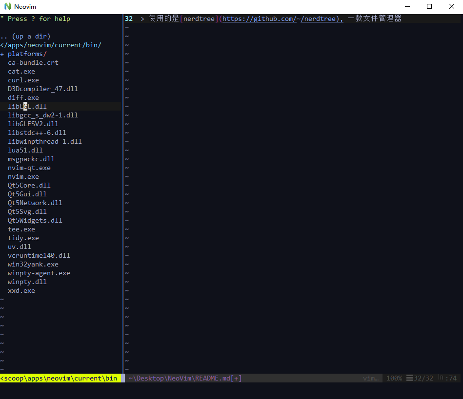
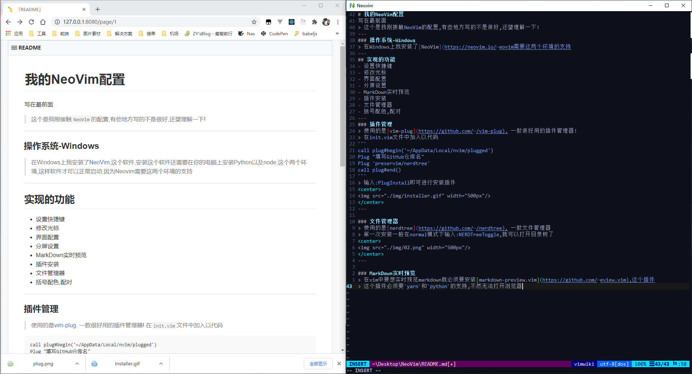

# 我的NeoVim配置
写在最前面
> 这个是我刚接触`NeoVim`的配置,有些地方写的不是很好,还望理解一下!
---
### 操作系统-Windows
> 在Windows上我安装了[NeoVim](https://neovim.io/),这个软件,安装这个软件还需要在你的电脑上安装Python以及node,这个两个环境,这样软件才可以正常启动,因为Neovim需要这两个环境的支持
---
## 实现的功能
- 设置快捷键
- 修改光标
- 界面配置
- 分屏设置
- MarkDown实时预览
- 插件安装
- 文件管理器
- 括号配色,配对
---
### 插件管理
> 使用的是[vim-plug](https://github.com/junegunn/vim-plug), 一款很好用的插件管理器!
> 在`init.vim`文件中加入以代码
```
call plug#begin('插件存放的位置')
Plug "填写GitHub仓库名"
Plug 'preservim/nerdtree'
call plug#end()
```
> 输入`:PlugInstall`即可进行安装插件
<center>

</center>
---

### 文件管理器
> 使用的是[nerdtree](https://github.com/preservim/nerdtree), 一款文件管理器
> 第一次安装一般在`normal`模式下输入`:NERDTreeToggle`,就可以打开目录树了
<center>

</center>
---

### MarkDown实时预览
> 在vim中要想实时预览markdown就必须要安装[markdown-preview.vim](https://github.com/iamcco/markdown-preview.vim),这个插件
> 这个插件必须要`yarn`和`python`的支持,不然无法打开浏览器
<center>

</center>

> 这个插件在安装完之后就可以在用vim编辑markdown文件时使用`:MarkdownPreview`来启动浏览器预览,`:MarkdownPreviewStop`来关闭浏览器,但是默认设置的话,启动的端口是随机的!

> 这个插件也可以自定端口来访问,这个可以方便在远程开发机上使用,然后用端口转发回本地预览!就很棒!!!
```
let g:mkdp_open_ip = '127.0.0.1'
let g:mkdp_port = 8080
function! g:Open_browser(url)
   silent exe '!lemonade open 'a:url
endfunction
let g:mkdp_browserfunc = 'g:Open_browser'
let g:mkdp_echo_preview_url = 1
```
> 需要用到端口转发的话,相信上面的代码多少都能看懂了吧!
